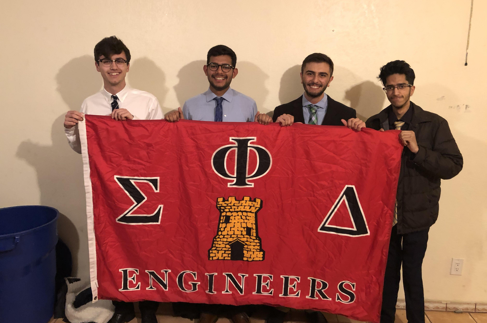
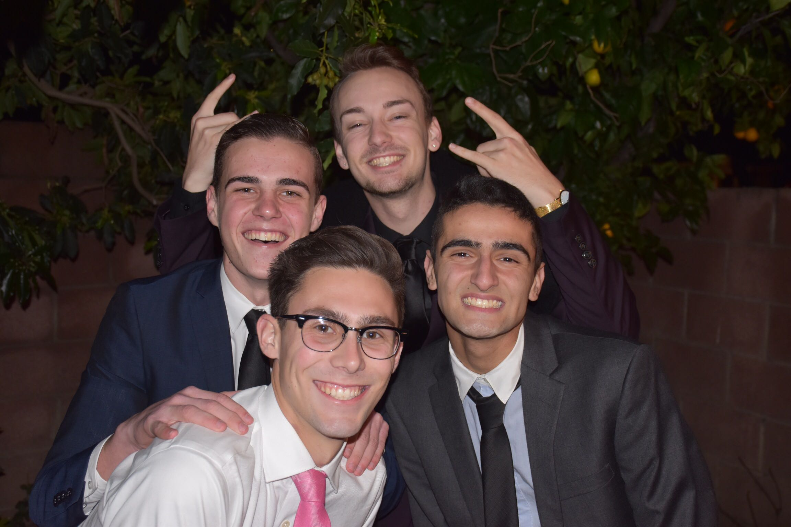

<!-- Main -->

<!-- One -->
<section id="one">
	

		<header class="major">
			<h1>Recruitment</h1>
		</header>

<!-- Content -->

	

		

		

		

	

<!-- Temporary Rush 2021 -->
<h2>WINTER RUSH 2021 t</h2>
<h3>What is Rush?!</h3>
	<h4>Rush week is a series of events we put on so you can learn more about Sigma Phi Delta. You don't have to come to every event! But the more you come to, the more interest you show in our organization.</h4>
	

			

				<h3>Monday 1/11: Intro Night! (Zoom)</h3>
				<ul>
					<li>Time: 6pm</li>
					<a href="https://calpoly.zoom.us/j/2857559283">JOIN ZOOM HERE</a>
					<li>We're starting the week off easy! Hop in the zoom to learn a little more about SPD, ask questions, and meet some of the bros!</li>
				</ul>
			

			

				<h3>Tuesday 1/12: Among Us Night (Zoom)</h3>
				<ul>
					<li>Time: 6pm</li>
					<a href="https://calpoly.zoom.us/j/2857559283">JOIN ZOOM HERE</a>
					<li>You've probably never heard of it, but there's this game called Among Us where you... just kidding. Come play Among Us and get to know the group better</li>
				</ul>
			

			

				<h3>Wednesday 1/13: Ted Talks from Brothers (Zoom)</h3>
				<ul>
					<li>Time: 6pm</li>
					<a href="https://calpoly.zoom.us/j/2857559283">JOIN ZOOM HERE</a>
					<li>As we are a professional engineering fraternity, we like to think some of us have some smart things to say. Some of our alumni are
						even doing smart things in the real world! Come listen to our Ted Talks and learn about SPD's industry connections.
					</li>
				</ul>
			

			

				<h3>Thursday 1/14: Trivia Night (Zoom)</h3>
				<ul>
					<li>Time: 6pm</li>
					<a href="https://calpoly.zoom.us/j/2857559283">JOIN ZOOM HERE</a>
					<li>Prove you're smart enough to join our fraternity. Just kidding, the trivia is just for fun... or is it a test? Probably not. Unless...?</li>
				</ul>
			

			

				<h3>Friday and Saturday: Invite only events</h3>
				<ul>
					<li>Rushees who have shown interest through participation in earlier rush event will be invited to these weekend events.</li>
				</ul>
			

			
<b>Please direct any questions to Recruitment Chairman Jeffrey Wexler: recruitment.spd.calpoly@gmail.com or (925) 446-2865</b>

		

<!-- Temporary Rush 2021 -->

<h2 id="content">Our Standards</h2>

We welcome men of all engineering majors to rush SPD. The Sigma Phi Delta Fraternity is historically known as a professional brotherhood of engineers. We hold professionalism and education among our highest priorities. All who wish to join must be studying either under the College of Engineering or an ABET accredited engineering major at Cal Poly. This includes the following majors:

	

		<ul>
			<li>Aerospace Engineering</li>
			<li>Architectural Engineering</li>
			<li>Biomedical Engineering</li>
			<li>Bioresource and Agricultural Engineering</li>
			<li>Civil Engineering</li>
			<li>Computer Engineering</li>
			<li>Computer Science</li>
			<li>Electrical Engineering</li>
		</ul>
	

	

		<ul>
			<li>Environmental Engineering</li>
			<li>General Engineering</li>
			<li>Industrial Engineering</li>
			<li>Liberal Arts and Engineering Studies</li>
			<li>Manufacturing Engineering</li>
			<li>Materials Engineering</li>
			<li>Mechanical Engineering</li>
			<li>Software Engineering</li>
		</ul>
	

</section>

